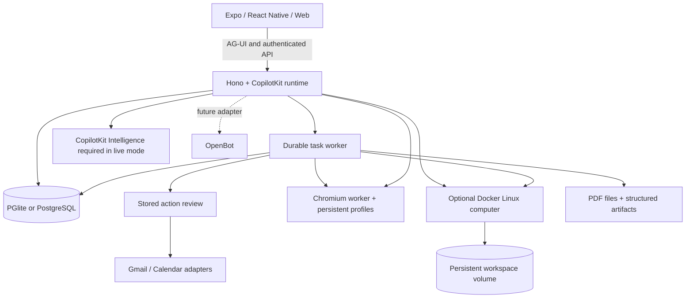

<div dir="rtl">

[English](README.en.md)

<div align="center">

# OpenMuse

**یک دستیار شخصی با مرورگر، ترمینال، فایل‌ها و کاری که ادامه پیدا می‌کند. سازگار با هر چارچوب اجرای عامل.**

نتیجه‌ای را که می‌خواهید بخواهید. برنامه را دنبال کنید، اقدام‌ها را بازبینی کنید و به نتیجه برگردید.
ساخته‌شده با CopilotKit React Native برای iOS، اندروید و وب.

[شروع سریع](#شروع-سریع) · [نمایش](#نمایش) · [امکانات](#امکانات) · [معماری](#معماری) · [مستندات](docs/README.md) · [مشارکت](CONTRIBUTING.md)

[](https://github.com/omidazg/openmuse/actions/workflows/ci.yml)
[](LICENSE)

این قالب را کلون کنید و هر طور که می‌خواهید سفارشی کنید.

**[روی OpenMuse چیزی می‌سازید؟ با تیم CopilotKit دیدار کنید ←](https://www.copilotkit.ai/openmuse)**

[](assets/demos/2026-09-16/mobile.mp4)

**[تماشای نمایش موبایل · ۳۸ ثانیه](assets/demos/2026-09-16/mobile.mp4)**

[](assets/demos/2026-09-16/web.mp4)

**[تماشای نمایش وب · ۴۲ ثانیه](assets/demos/2026-09-16/web.mp4)**

</div>

> **نسخهٔ آلفا، برای میزبانی شخصی و توسعه روی آن.** استدلال باز، حساب‌های واقعی گوگل و Rich Threads در CopilotKit به پیکربندی جداگانه نیاز دارند. [موارد راستی‌آزمایی‌شده](docs/VERIFICATION.md) و [نقشهٔ راه](ROADMAP.md) را ببینید.

## نمایش

در آیفون، از OpenMuse بخواهید داستان‌های جالب Hacker News را پیدا کند و CopilotKit را خلاصه کند. در دسکتاپ، از آن بخواهید ایمیل اردوی مدرسه را بررسی کند، پیام را باز کند و دربارهٔ نمایشگاه‌های آکواریوم خلیج مانتری تحقیق کند. عامل نتایج ایمیل و مرورگر را درون گفت‌وگو نشان می‌دهد. با **در دست گرفتن کنترل** همان نشست مرورگر هر وقت لازم بود باز می‌شود.

نمایش‌های ۳۸ ثانیه‌ای آیفون و ۴۲ ثانیه‌ای وب دسکتاپ، رابط کاربری فعلی را در کادر ۱۶:۹ نشان می‌دهند. هنگام پاسخ‌دادن عامل، فلش ارسال درون کادر ورودی به مربع توقف تبدیل می‌شود و بعد دوباره برمی‌گردد. توقف، پیش‌نویس شما را دست‌نخورده نگه می‌دارد. برای تنظیمات مدل و مراحل بازتولید، [یادداشت‌های ضبط](docs/DEMO.md) را ببینید.

[MP4 موبایل](assets/demos/2026-09-16/mobile.mp4) · [MP4 وب](assets/demos/2026-09-16/web.mp4) · [جزئیات ضبط و بازتولید](docs/DEMO.md)

## OpenMuse چیست

OpenMuse یک برنامهٔ دستیار شخصی با رایانهٔ عامل، کار قابل‌مشاهده و نتایج غنی است. سرور، پردازشگر وظایف و کارگر مرورگر خودش را اجرا می‌کند. می‌توانید کد منبع را تحت مجوز MIT بررسی و تغییر دهید.

این رایانه **Chromium ماندگار و یک فضای کاری لینوکسی اختیاری** را ترکیب می‌کند. عامل می‌تواند صفحه‌های عمومی را مرور کند، در کانتینر خودش فرمان اجرا کند، با فایل‌ها کار کند و فایل‌های PDF را بین رایانه و برنامه جابه‌جا کند. شما می‌توانید مرورگر یا ترمینال آن را باز کنید و کار را ادامه دهید. دسکتاپ‌های گرافیکی و پرداخت خودکار از کارهای آینده‌اند.

## امکانات

| بخش | آنچه در این نسخهٔ آلفا اجرا می‌شود |
| --- | --- |
| **گفت‌وگو** | گفت‌وگوی بدون‌رابط CopilotKit با رویدادهای جریانی AG-UI، جست‌وجو و خواندن صندوق نامه، ارسال/توقف در یک کادر ورودی، صف پیگیری قابل‌مشاهده، حفظ پیش‌نویس‌ها، وظایف واگذارشده و کارت‌های درون‌خطی ایمیل، مرورگر، PDF، برنامه و امور مالی. |
| **رایانهٔ عامل** | نمایه‌های ماندگار مرورگر و کنسول در دست گرفتن کنترل؛ ترمینال لینوکسی ایزولهٔ اختیاری، رسیدهای ذخیره‌شدهٔ فرمان‌ها، فایل‌های قابل‌ویرایش فضای کاری و انتقال PDF. |
| **فعالیت** | برنامه‌های ماندگار وظایف، پیشرفت، درخواست ورودی، مکث/ادامه/لغو/تلاش دوباره، تأییدها و رسیدهای ذخیره‌شده. اجاره‌های SQL کار قطع‌شده را بازیابی می‌کنند. |
| **ایده‌ها** | پیشنهادها همراه با شواهد منبع؛ ویرایش، پذیرش یا رد. پاسخ‌های ارسال‌شده و کارهای مشابهِ انجام‌شده کنار گذاشته می‌شوند. |
| **اهداف و پیگیری** | اهداف و نقاط عطف؛ بررسی دوره‌ای صفحه‌های عمومی برای تغییرات، موجودبودن متن یا آستانهٔ قیمت دلاری، با هشدارهای بدون تکرار و تأخیر افزایشی پس از خطا. |
| **اسناد** | پیوست ایمیل ← PDF ← مقادیر درخواستی فرم ← نسخهٔ پرشده ← پاسخ بازبینی‌شده ← رسید. نمایش PDF بومی/وب، صفحه‌بندی، بزرگ‌نمایی، فیلدهای پشتیبانی‌شده و اشتراک‌گذاری. |
| **امور مالی** | وارد کردن CSV تراکنش‌ها برای ساخت خلاصهٔ هزینه‌ها با دسته‌بندی‌ها، تراکنش‌ها و اقدام هدف پس‌انداز. |
| **Gmail و تقویم** | آداپتورهای Google OAuth، رشته‌های کامل نامه، پیش‌نویس‌ها/پیوست‌ها، کشف تقویم و ایجاد/به‌روزرسانی/حذف بازبینی‌شدهٔ رویدادها. به اعتبارنامه‌های واقعی نیاز دارد. |
| **زمینهٔ شخصی** | نام، لحن، آواتار و خاطره‌های قابل‌ویرایش. ترجیحات به‌روزرسانی پس‌زمینه و اعلان‌های ماندگار درون‌برنامه‌ای. |
| **Rich Threads** | ماندگاری CopilotKit Intelligence برای استقرارهای واقعی، با گفت‌وگوی اصلی پایدار، گفت‌وگوهای جانبی، تغییر نام، بایگانی، بازیابی و بازپخش. در حالت واقعی به کلید پروژهٔ مخصوص سرور نیاز است؛ حالت نمونه از تاریخچهٔ محلی استفاده می‌کند. |

[فهرست امکانات](docs/FEATURES.md) توانایی‌های پیاده‌سازی‌شده و گسترش‌های برنامه‌ریزی‌شده را شرح می‌دهد. اتصال به سلامت/بانک/شبکه‌های اجتماعی، اعلان روی دستگاه، صدا، ابزارهای اجرایی تولیدشده و رزرو/پرداخت خودکار در [نقشهٔ راه](ROADMAP.md) قرار دارند.

## شروع سریع

**پیش‌نیازها:** Node 24 LTS و pnpm 11.19.0. برنامهٔ نمونهٔ محلی به مدل، حساب گوگل، Docker یا اشتراک Intelligence نیاز ندارد.

<div dir="ltr">

```sh
git clone https://github.com/omidazg/openmuse.git openmuse
cd openmuse
pnpm install --frozen-lockfile
cp .env.example .env
pnpm dev
```

</div>

در یک ترمینال دیگر:

<div dir="ltr">

```sh
pnpm dev:web
```

</div>

[localhost:8081](http://localhost:8081) را باز کنید. API در [localhost:8787/api/health](http://localhost:8787/api/health) اجرا می‌شود.

### امتحان کنید

1. در گفت‌وگو، **«برگهٔ رضایت‌نامه را کامل کن»** را بفرستید. وظیفه را باز کنید، مقادیر فرضی فرم را وارد کنید، PDF ذخیره‌شده را بررسی کنید و پاسخ آماده‌شده را بازبینی کنید. این کار فقط در صندوق نامهٔ محلی می‌نویسد.
2. در **اهداف ← پیگیری**، یک پایشگر موجودی داخلی بسازید، سپس صفحهٔ آزمایشی داخلی را تغییر دهید تا هشدار فعال شود.
3. در **منو ← واگذاری وظیفه ← امور مالی**، با **امتحان تراکنش‌های نمونه** یک ردیاب تعاملی هزینه بسازید.
4. [کارگر مرورگر](#کارگر-مرورگر) را اجرا و یک مدل پیکربندی کنید، سپس بپرسید **«در Hacker News چیزهای جالب پیدا کن»** یا **«copilotkit.ai را خلاصه کن»**. مرورگر را درون گفت‌وگو دنبال کنید و با **در دست گرفتن کنترل** نشست آن را باز کنید. برای نسخهٔ بدون کلید این روند، [راه‌اندازی نمایش AI Mock](docs/DEMO.md#run-the-agent-browser-demo) را دنبال کنید.

برای iOS یا اندروید از `pnpm --dir apps/mobile ios` یا `pnpm --dir apps/mobile android` استفاده کنید. Xcode یا ابزارهای اندروید لازم است. نمایشگر PDF به یک Expo development build نیاز دارد؛ [راه‌اندازی بومی](apps/mobile/README.md) را ببینید.

## پیکربندی عامل و گوگل

تنظیمات توضیح‌دار موجود در [.env.example](.env.example) را در فایل خصوصی `.env` خود کپی کنید:

1. مقادیر `AGENT_BACKEND=model` و `MODEL=provider/model-id` و کلید ارائه‌دهندهٔ متناظر را تنظیم کنید. CopilotKit از ارائه‌دهندهٔ پیکربندی‌شدهٔ OpenAI، Anthropic یا Google پشتیبانی می‌کند. با مدل واقعی هم می‌توان از داده‌های فرضی استفاده کرد. کلیدهای ارائه‌دهنده روی سرور می‌مانند.
2. با `npx copilotkit@latest login` و `npx copilotkit@latest project select` یک پروژهٔ CopilotKit Intelligence بسازید یا انتخاب کنید. کلید تولیدشدهٔ `CPK_INTELLIGENCE_API_KEY` را روی سرور نگه دارید.
3. برای نامه/تقویم شخصی، `WORKSPACE_MODE=live`، کلید تولیدشدهٔ `CPK_INTELLIGENCE_API_KEY`، یک `OPENMUSE_ACCESS_KEY` تصادفی با دست‌کم ۲۴ نویسه و `TOKEN_ENCRYPTION_KEY` شامل ۳۲ بایت تصادفی با کدگذاری base64 را تنظیم کنید. API را دوباره راه‌اندازی کنید.
4. یک کلاینت وب Google OAuth با APIهای فعال Gmail و Calendar پیکربندی کنید. `GOOGLE_CLIENT_ID` و `GOOGLE_CLIENT_SECRET` را تنظیم کنید و `${PUBLIC_API_URL}/api/google/callback` را به‌عنوان نشانی بازگشت (redirect URI) ثبت کنید. دسترسی رضایت/کاربر آزمایشی را در پروژهٔ گوگل خود پیکربندی کنید.
5. **برنامه‌ها ← Gmail** (یا **Google Calendar**) را باز کنید، دسترسی خواندن را وصل کنید و در صورت نیاز دسترسی نوشتن بدهید. هر ارسال یا تغییر تقویم همچنان به بازبینی ذخیره‌شدهٔ خودش نیاز دارد. تغییر یا قطع اتصال حساب، کارهای در انتظارِ وابسته به آن اتصال را نامعتبر می‌کند.

اعتبارنامه‌های گوگل به‌صورت رمزشده ذخیره می‌شوند. نشانی فایل‌ها و کنسول‌های مرورگر از امضاهای کوتاه‌مدت استفاده می‌کنند. این استقرار یک مالک دارد که با یک کلید دسترسی مشترک محافظت می‌شود؛ یک سامانهٔ احراز هویت چندمستأجری نیست. برای میزبان راه دور از HTTPS و دسترسی شبکهٔ محدود استفاده کنید. حالت پیش‌فرض دادهٔ محلی را روی loopback نگه دارید.

## کارگر مرورگر

در `.env` مقدار `BROWSER_WORKER_URL=http://127.0.0.1:8790` و یک `WORKER_TOKEN` تصادفی با دست‌کم ۳۲ نویسه را تنظیم کنید.

<div dir="ltr">

```sh
pnpm --dir apps/worker exec playwright install chromium
pnpm dev:browser
```

</div>

یا از `docker compose --env-file .env -f infra/compose.yaml up --build -d` استفاده کنید. همان توکن باید به API و کارگر برسد. نشست‌ها نمایه‌های ماندگار Chromium دارند؛ برنامه می‌تواند یک کنسول زندهٔ اسکرین‌شات باز کند و فایل‌های PDF دانلودشده را وارد کند. ابزارهای عامل می‌توانند صفحه‌های عمومی را بخوانند و کار تعاملی را به کاربر بسپارند. [راه‌اندازی کارگر و مرزهای آن](apps/worker/README.md).

## ماندگاری و بهره‌برداری

### ترمینال و فضای کاری لینوکس

ایمیج رایانه را بسازید، آن را روی API فعال کنید، سپس **رایانه ← ترمینال ← روشن کردن رایانه** را باز کنید:

<div dir="ltr">

```sh
docker build -t openmuse-computer:local apps/computer
COMPUTER_ENABLED=true pnpm dev
```

</div>

API به Docker CLI و موتور آن دسترسی نیاز دارد. فرمان‌ها در یک کانتینر غیرروت بدون اتصال پوشه‌های میزبان یا اعتبارنامه اجرا می‌شوند. یک volume نام‌دار `/workspace` فایل‌ها را پس از توقف نگه می‌دارد. شبکهٔ ترمینال غیرفعال است؛ دسترسی به وب عمومی از طریق کارگر مرورگر انجام می‌شود. فرمان‌ها محدودیت ۳۰ ثانیه‌ای و رسید ذخیره‌شدهٔ خروجی/کد خروج دارند. بخش **فایل‌ها** از پوشه‌ها، ویرایش متن و انتقال PDF به/از اسناد پشتیبانی می‌کند. این یک کانتینر لینوکس است، نه یک ماشین مجازی کامل سیستم‌عامل. [راه‌اندازی، گزینهٔ Colima و مرزها](docs/COMPUTER.md).

### ذخیره‌سازی برنامه

به‌طور پیش‌فرض، PGlite تعبیه‌شده، اسناد و کلید امضا در `.openmuse/` و نمایه‌های مرورگر در `.openmuse/browser-profiles/` قرار دارند. این پوشه را خصوصی نگه دارید و از آن پشتیبان بگیرید. API میزبان پردازشگر وظایف است. برای کار پس‌زمینه، میزبان باید روشن بماند.

برای پردازشگر وظایف جداگانه، `DATABASE_URL`، رازها و `DATA_DIR` مشترک یکسانی را برای هر دو فرایند پیکربندی کنید، سپس `TASK_WORKER_ENABLED=false` را روی API تنظیم کنید و `pnpm dev:worker` را اجرا کنید. PGlite را نمی‌توان از فرایندهای جداگانه باز کرد. فرمان‌های تولید `pnpm build:server`، `pnpm start` و `pnpm start:worker` هستند. فقط یک نمونه از API اجرا کنید؛ پردازشگرهای وظایف از طریق اجاره‌های SQL هماهنگ می‌شوند.

پس از یک نوشتن خارجی نامطمئن، هیچ تلاش دوبارهٔ پنهانی رخ نمی‌دهد. پیش از ایجاد جایگزین، نتیجهٔ آن را نزد ارائه‌دهنده بازبینی کنید. مکث/لغو از مراحل بعدی وظیفه جلوگیری می‌کند؛ درخواستی که پیش‌تر تأیید شده و در حال اجراست ممکن است به پایان برسد.

## CopilotKit Rich Threads

استقرارهای واقعی برای ماندگاری و بازپخش گفت‌وگو با CopilotKit Intelligence به `CPK_INTELLIGENCE_API_KEY` روی سرور API نیاز دارند. با `npx copilotkit@latest login` و `npx copilotkit@latest project select` یک پروژه بسازید یا انتخاب کنید، کلید تولیدشدهٔ مخصوص سرور را تنظیم کنید و API را دوباره راه‌اندازی کنید. منوی بومی از `useThreads` استفاده می‌کند؛ نتایج غنی ابزارها به وظایف، اسناد و نشست‌های مرورگر ذخیره‌شده پیوند دارند.

در حالت نمونه می‌توان کلید را تنظیم نکرد و یک گفت‌وگو در پایگاه دادهٔ محلی نگه داشته می‌شود. Intelligence یک سرویس جداگانه است و مشمول مجوز MIT این مخزن نیست. هیچ کلید پروژه‌ای همراه مخزن ارائه نمی‌شود. [پیکربندی و مرزهای اعتبارسنجی](docs/RICH-THREADS.md).

## معماری

<div dir="ltr">



</div>

| پوشه | کاربرد |
| --- | --- |
| `apps/mobile` | رابط کاربری مشترک iOS، اندروید و وب با هوک‌های بدون‌رابط CopilotKit. |
| `apps/server` | API، محیط اجرای CopilotKit، مرز هویت، موتور وظایف، بازبینی‌ها، فایل‌ها و ماندگاری. |
| `apps/worker` | سرویس مرورگر Playwright محافظت‌شده با توکن و نمایه‌های ماندگار. |
| `apps/computer` | ایمیج لینوکس غیرروت، ابزار کمکی محدود فایل‌سیستم و راستی‌آزمایی کانتینر واقعی. |
| `packages/domain` | انواع مشترک و اعتبارسنجی درخواست‌ها. |
| `packages/integrations` | آداپتورهای پروتکل گوگل و مرورگر. |
| `packages/backends` | آداپتور HTTP اختیاری OpenBot و مرز هویت آن. |
| `tests` | آزمون‌های روند کار، محیط اجرا، ماندگاری، قرارداد ارائه‌دهنده و مجوزدهی. |

### سازگاری با OpenBot

کلاینت بومی و روندهای دستیار شخصی OpenMuse مستقل از OpenBot هستند. آداپتور غیرفعال OpenBot روی نسخهٔ مشخصی ثابت شده و در برابر رابط‌های بالادستی آزمون قرارداد دارد. پل‌زدن زندهٔ کاربر/نشست، نگاشت روال‌ها و اتصال پشتیبان رایانه از کارهای آینده‌اند. محیط اجرای Intelligence در OpenBot یک نقطهٔ پایانی خام AG-UI نیست. [قرارداد یکپارچه‌سازی](docs/OPENBOT-INTEGRATION.md).

## فارسی‌سازی

این فورک به‌طور کامل برای کاربران فارسی‌زبان بومی‌سازی شده است:

- **رابط کاربری کاملاً فارسی** در iOS، اندروید و وب.
- **چیدمان راست‌به‌چپ (RTL)** در همهٔ صفحه‌ها؛ آیکون‌های جهت‌دار قرینه می‌شوند و نشانی‌ها، کد و خروجی ترمینال چپ‌به‌راست می‌مانند.
- **قلم وزیرمتن** (اثر صابر راستی‌کردار، با مجوز SIL Open Font License) که از طریق `@expo-google-fonts/vazirmatn` و `expo-font` بارگذاری می‌شود.
- **ماژول کمکی `apps/mobile/src/locale.ts`** شامل ثابت `LOCALE="fa-IR"`، تابع `fw()` برای انتخاب وزن قلم (به‌جای `fontWeight`)، توابع `faNumber` و `faDigits` برای نمایش ارقام فارسی، `faDate` و `faDateTime` برای تاریخ هجری خورشیدی، `faMoney` برای مبلغ با واحد پس از عدد («۱۲٬۰۰۰ تومان») و `toLatinDigits` برای تبدیل ارقام فارسی و عربی ورودی کاربر پیش از اعتبارسنجی.
- **پاسخ‌های عامل به‌طور پیش‌فرض به فارسی** هستند.

قواعد نگارش، چیدمان، اعداد و تاریخ در [docs/persian-rules.md](docs/persian-rules.md) آمده است که بر پایهٔ رهنمودهای [VibeFarsi](https://github.com/TronIsHere/vibafarsiui) نوشته شده. برای آشنایی کوتاه با فارسی‌سازی پروژه، [docs/FA.md](docs/FA.md) را ببینید.

## استقرار روی ابرآروان

برای استقرار OpenMuse روی زیرساخت ابرآروان (ArvanCloud)، راهنمای [deploy/arvan/README.fa.md](deploy/arvan/README.fa.md) را دنبال کنید.

## توسعه

<div dir="ltr">

```sh
pnpm lint
pnpm typecheck
pnpm test
pnpm build:server
pnpm build:web
pnpm build:ios
pnpm build:android
pnpm --dir apps/worker typecheck
pnpm test:browser
pnpm test:computer
```

</div>

اسکریپت‌های ساخت پلتفرم، باندل‌های JavaScript/Hermes را خروجی می‌گیرند و فایل اجرایی امضاشدهٔ برنامه تولید نمی‌کنند. بررسی‌های مرورگر به Chromium نصب‌شده و دسترسی به فیکسچرهای عمومی نیاز دارند. CI کانتینرهای مرورگر و رایانهٔ لینوکسی را هم آزمایش می‌کند. [راهنمای مشارکت](CONTRIBUTING.md) و [نتایج راستی‌آزمایی](docs/VERIFICATION.md) را ببینید.

## مشارکت و مجوز

گزارش مشکل (issue) و درخواست ادغام (pull request) پذیرفته می‌شود. با [CONTRIBUTING.md](CONTRIBUTING.md)، [ROADMAP.md](ROADMAP.md) و [سیاست امنیتی](SECURITY.md) شروع کنید.

با مجوز MIT. ساختهٔ CopilotKit؛ این مخزن فورکی از پروژهٔ اصلی [CopilotKit/OpenMuse](https://github.com/CopilotKit/OpenMuse) است و رابط اصلی و دارایی‌های فرضی آن را در بر دارد. محتوای وب‌سایت‌ها، ایمیل‌ها و اسناد فقط شاهد و قرینه فراهم می‌کند، نه اجازهٔ اقدام.

</div>
